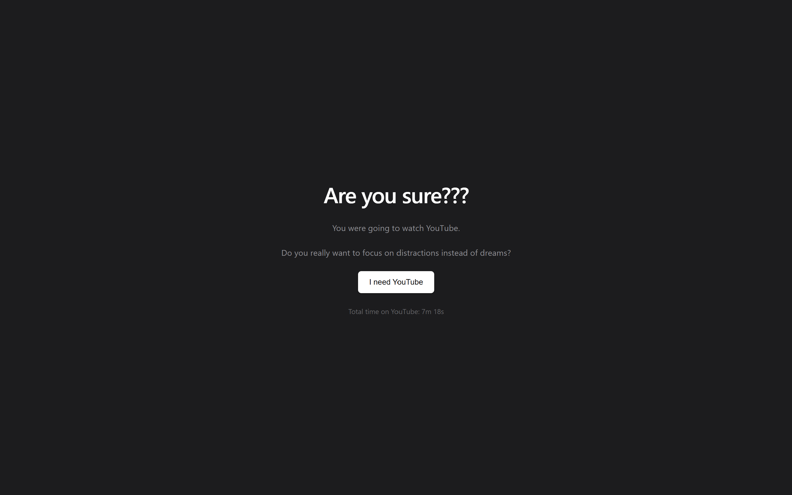
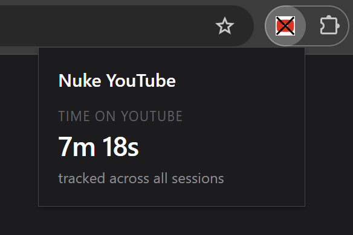

# Nuke YouTube

Are you done wasting time spending hours mindlessly wasting your life away watching some youtube video that you will not remeber a lick about after you finish watching it. Look no further then this mindfull chrome extension that blocks YouTube and replaces it with a focus prompt. When you try to visit YouTube, you're redirected to a page that asks if you really want to be distracted. If you do need to watch something specific(tutorials, school work, or the best new music video), you can paste a direct video link — only that exact video is allowed through. Dont even try clicking on another video or you will be banned from watching. 

## Features

- Blocks all YouTube pages and redirects to a focus prompt
- Allows watching a specific video by pasting its URL
- Automatically re-blocks once the video tab is closed
- Tracks total time spent on YouTube across all sessions
- Clean popup showing your tracked time

## Installation

This extension is not on the Chrome Web Store. You need to load it manually (sorry):

1. Download or clone this repository to your computer
2. Open Chrome and navigate to `chrome://extensions`
3. Enable **Developer mode** using the toggle in the top right
4. Click **Load unpacked** and select the project folder
5. The extension is now active — try visiting YouTube

## How it works

When you navigate to any YouTube URL, the extension's background script intercepts the navigation and redirects you to the focus page. If you paste a specific video link and click Watch, only that video is permitted. Navigating to any other YouTube page (homepage, search, recommendations) from within that tab will redirect you back to the focus prompt. Once you close the YouTube tab, the extension re-blocks automatically.

## Usage

- **Visiting YouTube** — you'll be redirected to the focus prompt
- **Watching a specific video** — click "I need YouTube", paste a direct video URL (e.g. `https://www.youtube.com/watch?v=...`), and click Watch
- **Viewing your stats** — click the extension icon in the Chrome toolbar to see your total tracked time

